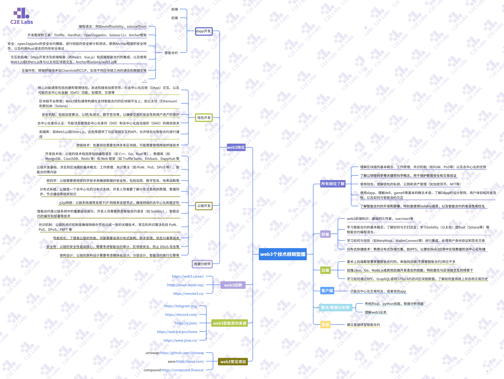

# 相关资料
## MetaMask

Rust 资料 https://kaisery.github.io/trpl-zh-cn/ch01-02-hello-world.html   
学习资料 https://github.com/smartcontractkit/Web3_tutorial_Chinese  
编程环境 https://remix.ethereum.org/
web3学习资料和工作机会 https://wcngrtwsafnt.feishu.cn/wiki/VqDqwq3jXirAkXkeHOFc4D9anof   
https://docs.chain.link/    
MetaMask  metamask登录密码 baichuan24G   
   https://kcno38rbm7bc.feishu.cn/wiki/OQ5lwXujliSOA4khSZjc0jagnYJ 
 Etherscan.io 这个网站的 账号: JianCai0706 密码: qPH8.!-UQ9e9g/5   
 App Name: web3  APIKeyToken : 2GAIWVSPN4XMC1GVW7I4X1G5AS8CV95BZ1  
  web3社区 https://discord.gg/hEKMJEwPXb  
 水龙头 https://faucets.chain.link/ 
 查询网络的id 网址 https://chainlist.org/ 比如 Ethereum Sepolia 11155111  以太坊主网: Ethereum Mainnet 1
 https://faucets.chain.link/ 领取ETH测试网的币  
 https://sepolia.etherscan.io/tx/0xa8b86d1b578f27c32ca76cbae8717eeab649b6a4b67f3074bf5c3fe9df78402a 查看交易记录  
 跟我学 Solidity https://learnblockchain.cn/article/1952 

 ERC20 标准合约 https://docs.openzeppelin.com/contracts/4.x/erc20  

 node -v  
 node init  
 npm install hardhat --save-dev  
 npx hardhat  node情况下运行某个命令  
 怎么在这个路径下打开vscode呢 命令是什么 code .  

node -v 查看当前node的版本            
#### 1. npm init 创建一个 nodejs项目，会有package.json文件         
#### 2 . code . vscode 打开当前的文件夹        

#### 3 .npm install hardhat --save-dev   安装 hardhat包 只有开发环境使用 安装后 package.json多了内容  "devDependencies": {
    "hardhat": "^2.24.2"
  }
#### 4 . npx hardhat  通过npm 创建一个hardhat项目 这时package.json会多 @nomicfoundation/hardhat-toolbox  还会多了contracts文件夹    
.gitignore 会忽略哪些文件  

ignition文件夹  
hardhat.config.js文件   
contract文件夹  
test文件夹  
#### 5.  npm install @chainlink/contracts --save-dev 安装这个包 package.json的 devDependencies会多出 @chainlink/contracts  
#### 5.1 npm uninstall @chainlink/contracts 删除命令
#### 6.  npx hardhat compile 这个命令编译所有在contract文件夹的sol文件 显示： Compiled 2 Solidity files successfully (evm target: paris)

#### 7. Ethers.js的安装命令 npm install --save ethers  
ethers.js 的网址是: https://docs.ethers.org/v6/api/  
#### 8. npx hardhat run scripts/DeployFundeMe.js   显示如下： 
contract is deploying  
contract has been deployed successfully,contract address is 0x5FbDB2315678afecb367f032d93F642f64180aa3  
 
如果没成功就 rm -rf artifacts cache 再次运行 npx hardhat compile 以及npx hardhat run scripts/DeployFundeMe.js  
 
npm install --save-dev dotenv  安装第三方的包   
##### Alchemy,Infura,QuickNode //第三方服务商   
#### 9. npm install --save-dev dotenv   
#### 10. npm install --save-dev @chainlink/env-enc  加密的包 明文变密文  
#### 11. npx env-enc set-pw 设置密码111111   
#### 12 . npx env-enc set    
SEPOLIE_URL    PRIVATE_KEY     
Please enter the variable value (input will be hidden):
**********************************************
Would you like to set another variable? Please enter the variable name (or press ENTER to finish):   
PRIVATE_KEY   
会多一个配置文件 显示如下:  
npm install --save-dev dotenv  
##### 13. 多出一个文件: .env.enc
SEPLIO_URL: ENCRYPTED|YeqxnACd4b1r+iG3cz04PSUogDd5JN4UReAcHNMiVjdcrIeZ0AkuXdCsIR6Hpe5NprGWixsJ9jfO0xQjY0QGmii0Bqx/A2Vkn3Tb4tc7AJdkELZhp7Hi/yNbdUsmTA==       
PRIVATE_KEY: ENCRYPTED|s7BL6qGaXjpbLDrNAVRLbANXqXRpZaSEh0DmP370Ie+Q3fweqTWnTciY06uEpssu9bBp5GF4                

#### 14. 然后harthat.config.js里面的 require("dotenv").config 改为 require("@chainlink/env-enc").config()   
require("@nomicfoundation/hardhat-toolbox");  
require("dotenv").config  =>  require("@chainlink/env-enc").config()  
然后运行命令  npx hardhat run scripts/deployFundeMe.js --network sepolia    

npm install --save-dev @chainlink/env-enc

solana教程  https://ruilab.xyz/blockchain  

 
##### hardhat deploy官网有教程 大有收获： https://www.npmjs.com/package/hardhat-deploy  

